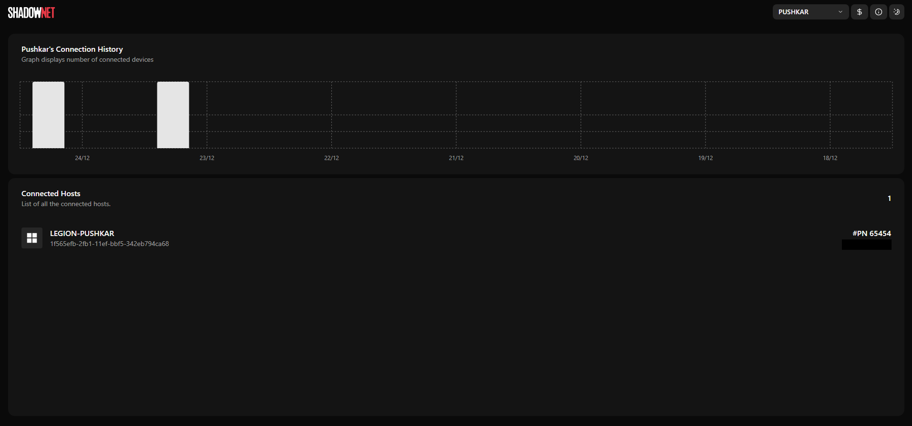
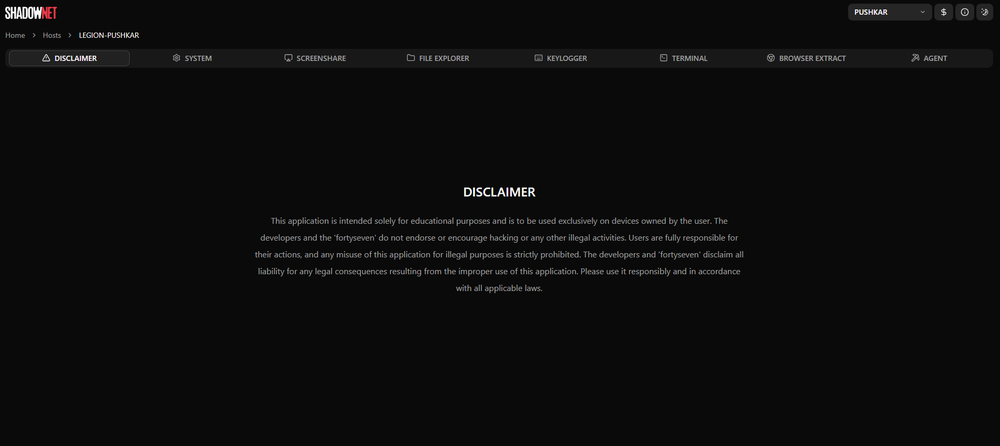
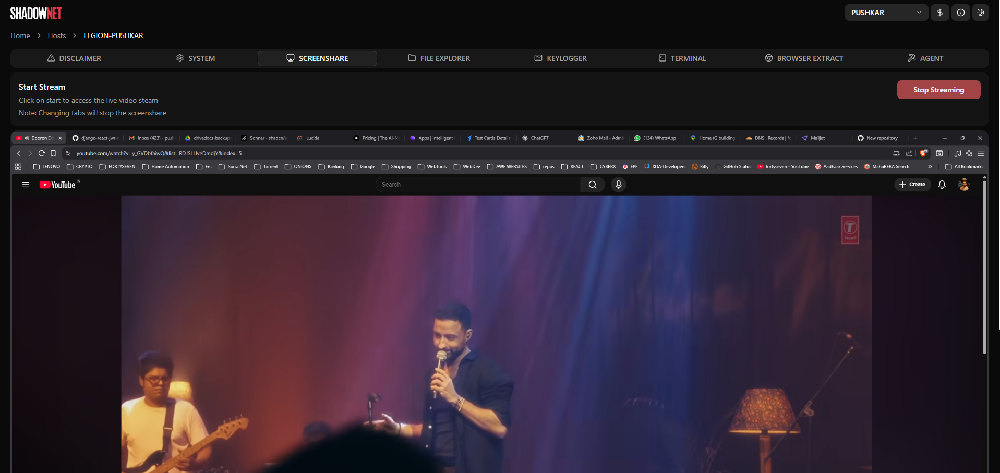
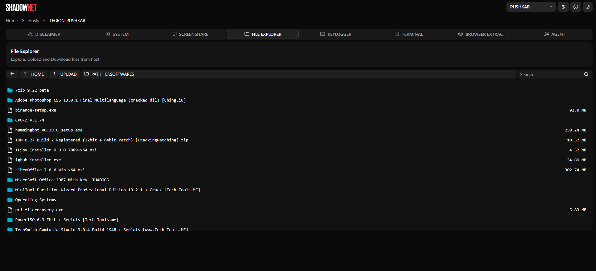
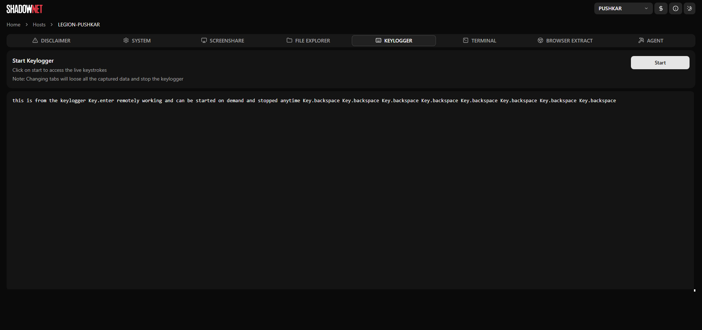
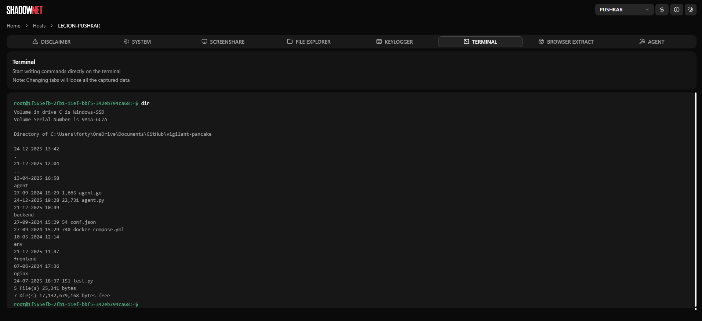
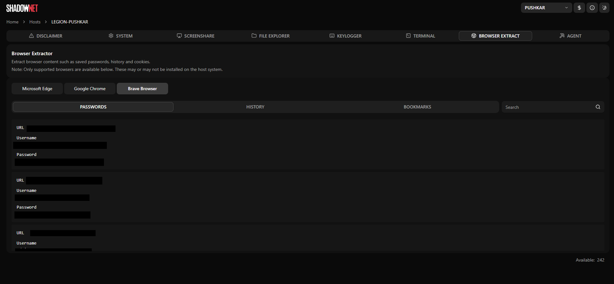

# SHADOWNET

ShadowNet is an open-source, web-managed Remote Administration Tool (RAT) that allows you to manage connected hosts remotely through a browser-based interface.

---

### Features
- Keylogger
- Screenshare
- System Information (IP address/Hardware Configuration/Disk Information/Running Processes can be terminated)
- File Explorer (Upload/Download/Delete)
- CMD/Terminal full access
- Browser Extractor (Passwords/History/Bookmarks)
- On click agent terminate

### Frontend
- React.js
- Tailwind CSS
- Redux
- Recharts

### Backend
- Django
- Django REST Framework
- Django Channels

### Infrastructure
- Nginx
- Docker & Docker Compose

### Prerequisites
- Docker
- Docker Compose

### Steps
1. Clone the repository:

   ```bash
   git clone https://github.com/fortysev-en/shadownet.git
   ```


### Project Structure
shadownet/  
│  
├── frontend/ # frontend  
├── backend/ # backend  
├── agent/ # agent  
│ ├── agent.py  
│ └── requirements.txt  
├── docker-compose.yml  
└── README.md


### Agent Configuration
1. Install dependancies

    ```bash
    cd agent
    pip install -r requirements.txt
    ```
- Open agent/agent.py
- Add server's Public IP to PUBLIC_SERVER_IP_ADDRESS
- Build with pyinstaller
2. Build with PyInstaller

    ```bash
    pyinstaller --onefile agent.py
    ```

### Screenshots

#### 1. Dashboard


#### 2. Host


#### 3. System


#### 4. Screenshare


#### 5. Explorer


#### 6. Keylogger


#### 7. Terminal


#### 8. Browser
